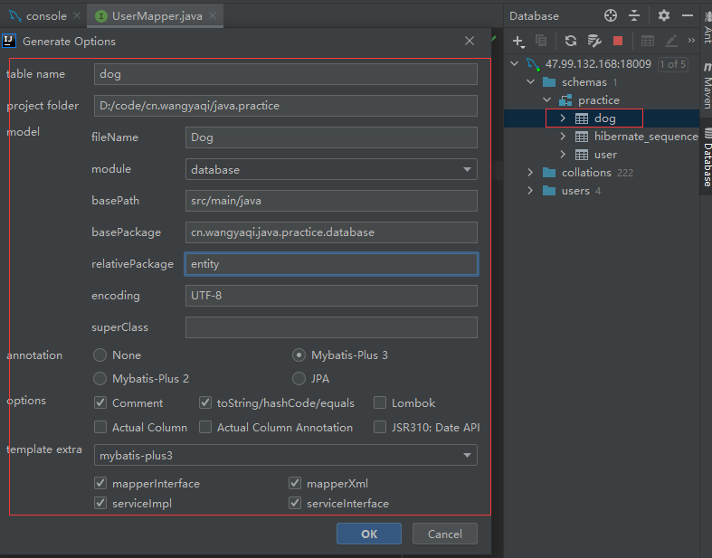

# Java最佳实践

# 目录说明

| 目录 | 说明 |
| :-: | - |
| misc | 杂项集合 |
| database | 数据库连接 |
| autotest | 自动化测试：接口单元测试，接口集成测试 |

# misc
## Actuator
* https://www.liaoxuefeng.com/wiki/1252599548343744/1282386381766689

## Swagger
* https://juejin.cn/post/6844903991793418248
* http://localhost:8080/swagger-ui/index.html

# database
## JPA
### 资料
* domainentity, dao, service, controller
* https://cloud.tencent.com/developer/article/1685970

## MyBatis
### 资料
* domain, mapper, service, controller
* [官网](https://mp.baomidou.com/guide/quick-start.html), [所有注解](https://mp.baomidou.com/guide/annotation.html#tablename)
* [MyBatis与MyBatis-plus的区别](https://www.jianshu.com/p/8556c8468241)
* [使用示例](https://www.cnblogs.com/l-y-h/p/12859477.html)
### 代码生成文件
* 自定义代码生成器【推荐】，CodeGenerator.java，修改参数
    * [自定义代码生成器](https://mp.baomidou.com/guide/generator.html)
    * [自定义代码生成器](https://juejin.cn/post/6844904190683119629)
* [插件代码生成器](https://mp.baomidou.com/guide/mybatisx-idea-plugin.html) ，生成代码

### 代码生成SQL函数
* https://mp.baomidou.com/guide/mybatisx-idea-plugin.html，生成查询等
### 代码写法
```
entity的创建时间和更新时间
@JsonFormat(pattern = DateUtil.DateTimeFormat)
@TableField(value = "create_time", fill = FieldFill.INSERT)
private LocalDateTime createTime;

@JsonFormat(pattern = DateUtil.DateTimeFormat)
@TableField(value = "update_time", fill = FieldFill.INSERT_UPDATE)
private LocalDateTime updateTime;
```