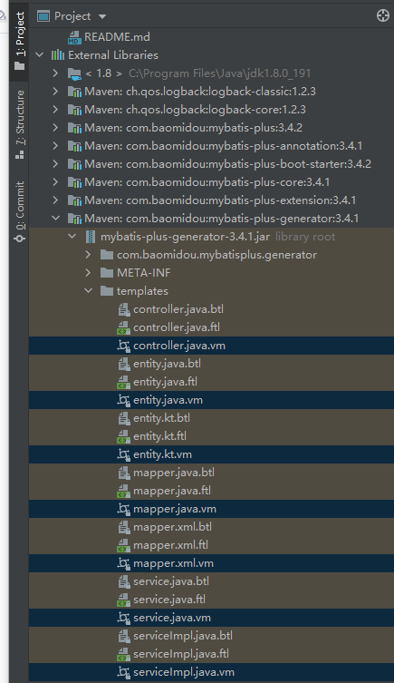

# Java最佳实践

# 目录说明

| 目录 | 说明 |
| :-: | - |
| misc | 杂项集合 |
| autotest | 自动化测试：接口集成测试；接口单元测试，函数单元测试 |
| database-mp | MySQL+MP，多租户 |
| database-jpa | MySQL+JPA，无租户 |
| database-dm | 达梦数据库8+MP+东方通7，无租户 |
| wartest | war包打包和测试，基于Tomcat8 |

# misc
## Actuator
* https://www.liaoxuefeng.com/wiki/1252599548343744/1282386381766689

## Swagger
* https://juejin.cn/post/6844903991793418248
* http://localhost:8080/swagger-ui/index.html

# autotest
* https://java.wangyaqi.cn/#/material/ut

## junit5
* https://www.baeldung.com/junit-assertions

## spring
* https://www.codehome.vip/archives/springboot-test
* https://blinkfox.github.io/2019/03/02/hou-duan/spring/springboot2.x-dan-yuan-ce-shi/

# database-mp
## 资料
* [官网](https://mp.baomidou.com/guide/quick-start.html), [所有注解](https://mp.baomidou.com/guide/annotation.html#tablename)
* [MyBatis与MyBatis-plus的区别](https://www.jianshu.com/p/8556c8468241)
* [使用示例](https://www.cnblogs.com/l-y-h/p/12859477.html)
* [官方示例](https://gitee.com/baomidou/mybatis-plus-samples)

## 注意事项
* 多租户的联表查询：每个表要有租户编号，sql里每个表都要给别名

## 代码生成文件
* [自定义代码生成器【推荐】](https://gitee.com/qiya365/longquan/code.generator) : 参数详见jar包里的示例，[资料1](https://mp.baomidou.com/guide/generator.html), [资料2](https://juejin.cn/post/6844904190683119629)
* [插件代码生成器](https://mp.baomidou.com/guide/mybatisx-idea-plugin.html) ， 

* 模板使用和开发
    * 模板文件：
    * 启用方法：templateConfig.setController("templates/controller.java.vm");

## 代码生成SQL函数
* https://mp.baomidou.com/guide/mybatisx-idea-plugin.html，生成查询等

## 代码写法
```
尽量都在service写，不要写mapper，join的没办法

# entity
## 创建时间和更新时间
updateById()更新时间自动修改：@TableField(update = "now()")
## 逻辑删除
```

# database-jpa
## 资料
* https://cloud.tencent.com/developer/article/1685970

# database-dm
## 资料
### 达梦数据库8连接
* 有效方案：https://my.oschina.net/jeecg/blog/4302268
```
mvn install:install-file -DgroupId=com.dm -DartifactId=DmJdbcDriver18 -Dversion=1.8 -Dpackaging=jar -Dfile=./s/database-dm/DmJdbcDriver18.jar
```
* 无效方案[达梦数据库8 jdbc](https://gitee.com/fuile/dameng/blob/master/repository-%E8%BE%BE%E6%A2%A68maven.zip)

## 注意事项
* 表名大写，字段大写
* 1个账号下只有1个模式

## 命令
```
select * from SYS.ALL_OBJECTS where ALL_OBJECTS.OWNER='PSC' AND OBJECT_TYPE='SCH'; // 查PSC账号下的模式/库

```

# wartest
## 代码调整
```
pom.xml新增内容:
  <packaging>war</packaging>

    <dependency>
      <groupId>org.springframework.boot</groupId>
      <artifactId>spring-boot-starter-tomcat</artifactId>
      <scope>provided</scope>
    </dependency>

  <build>
    <finalName>api</finalName>
    <plugins>
      <plugin>
        <groupId>org.springframework.boot</groupId>
        <artifactId>spring-boot-maven-plugin</artifactId>
      </plugin>
    </plugins>
  </build>

新增类：MySpringBootServletInitializer
```

## 打包
mvn package

## 部署

| 项 | 说明 | Tomcat | 东方通 |
| :-: | - | - | - |
| API | http://domain/war包名/ | war包放到webapps/ROOT/ | war包上传 |
| Html  | http://domain/ | 文件放到webapps/ROOT/ | 选择目录(有index.html等)内的所有文件压缩，压缩文件后缀改成war，上传war包 |